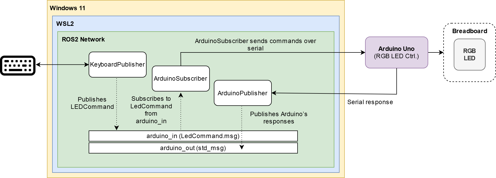

# tu_ros2_mmi

## Project Overview

This project demonstrates using ROS2 to control an Arduino with RGB LEDs. It consists of several ROS2 nodes and a custom message type to realize communication between a keyboard, a ROS2 system, and an Arduino, working on Windows under WSL2. For .pdf documentation, refer to the [project documentation](assets/pdfs/Assignment_MMI_TU_Wien_Project_Report_Michael_Smirnov.pdf).



### Demo

https://github.com/user-attachments/assets/534a4c6e-c226-4c94-b465-d487a0b0db47

<video src='assets/vids/mmi_demo.mp4' width="480" controls>
  Your browser does not support the video tag.
</video>

### ROS2 Setup

- **Topics**:

  - `arduino_in`: Used for sending `LedCommand` messages from the `KeyboardPublisher` node to the `ArduinoSubscriber` node.
  - `arduino_out`: Used for publishing messages from the Arduino to the ROS2 system via the `ArduinoPublisher` node.

- **Nodes**:
  - `KeyboardPublisher`: Captures keyboard inputs and publishes `LedCommand` messages to the `arduino_in` topic.
  - `ArduinoSubscriber`: Subscribes to the `arduino_in` topic, receives `LedCommand` messages, and sends corresponding commands to the Arduino via serial communication.
  - `ArduinoPublisher`: Reads data from the Arduino via serial communication and publishes it to the `arduino_out` topic.

### Custom Message Type

- **LedCommand.msg**:
  ```msg
  int32 led_id
  int32 r_value
  int32 g_value
  int32 b_value
  ```
  This message type is used to specify the LED ID and RGB values for controlling the LED colors on the Arduino.

### Arduino Code

The Arduino code listens for incoming commands from the ROS2 system, parses the commands, and sets the RGB LED colors accordingly. Finally it responds with the commands it executed in the `arduino_out` topic.

### Arduino Schematic


## Prerequisites

### WSL2 Setup (Optional)

If you want to open `.ino` files with the Arduino IDE in Windows while working in WSL2:

- Mount WSL2 as a network drive in Windows
- See: [Arduino IDE Issue #1797](https://github.com/arduino/arduino-ide/issues/1797)
- Solution detailed [here](https://superuser.com/questions/1738361/how-to-mount-a-wsl2-folder-as-a-network-drive-in-windows-10)

### USB Passthrough Setup

1. Install [usbipd-win](https://github.com/dorssel/usbipd-win):

```powershell
winget install usbipd
```

2. Connect USB device:

```powershell
# List available devices
usbipd list

# Bind device
usbipd bind --busid=XXX

# Attach to WSL2
usbipd attach --wsl --busid=XXX
```

3. Verify connection in WSL2:

```bash
lsusb
```

### Arduino Development Workflow

When modifying Arduino code:

1. Disconnect device from WSL2
2. Flash sketch using Arduino IDE in Windows
3. Reattach to WSL2: `usbipd attach --wsl --busid=XXX`
4. Device will be available at `/dev/ttyACM0` (or similar)

### Keyboard Input

This project uses [sshkeyboard](https://sshkeyboard.readthedocs.io/en/latest/) for keyboard input in WSL2:

- Works in headless environments
- No X server dependency
- No root access required
- No external dependencies

## Running ROS2 Nodes

### Installing Dependencies

Before building the workspace, resolve package dependencies:

```bash
# Navigate to workspace root
cd ..

# Install dependencies
rosdep install -i --from-path src --rosdistro humble -y
```

### Building the Workspace

From the workspace root:

```bash
# Build packages with symlink install
colcon build --symlink-install
```

Note: `--symlink-install` prevents rebuilding when modifying Python scripts.

### Sourcing the Workspace

Open a new terminal and run:

```bash
source /opt/ros/humble/setup.zsh && source install/setup.zsh
```

Important: Always source in a new terminal to avoid build conflicts.

### Running Packages

Execute nodes using:

```bash
ros2 run color_led <NODE_NAME>
```

Note: Node names are configured in `ros2/src/color_led/setup.py` under `console_scripts`.
